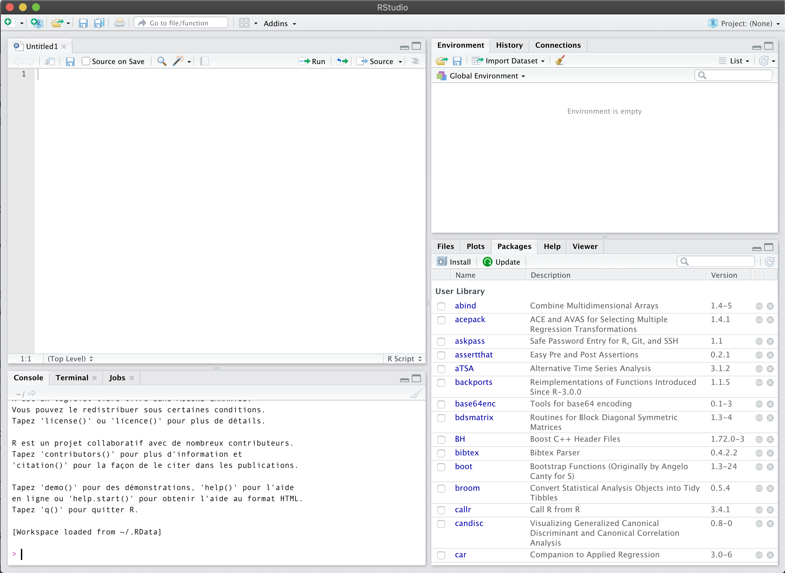
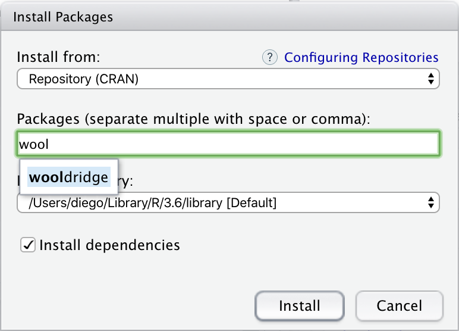

```{r setup, include=FALSE}
knitr::opts_chunk$set(echo = TRUE)
library(knitr)
```

## R Introduction

With this tutorial you will be able to get started with R. You will become familiar with some basic commands that will be useful to perform statistical analysis. We will cover how to import data, install packages, look at your data, create summary tables, basic plots and linear regression.

## Downloading and installing RStudio

First, you need to install R. Go to <https://r-project.org>, download R from any mirror, preferably from one that is close to you, and follow the installation instructions. Next, you need to install RStudio, visit <https://rstudio.com> and download the RStudio Desktop free open source edition for your system. This edition includes all the features of the program, the difference with the pro version is the dedicated support and commercial licence.

## First look: The workspace

In order to get started we first look at how RStudio looks when you first open it. In Figure (\ref{fig:rimg}) we can see the RStudio workspace. In the top left there is the script, which is where you write the code of your project. On the bottom left there is the console, where you can run pieces of code and most of the output shows up. Top right there is the environment, where our variables, data and functions are listed. And in the bottom right you can see the packages that are installed and activated, also plots and help show up here.

```{r rimg, echo=FALSE, fig.align='center', fig.cap="First look at RStudio.", out.width='100%'}

```

Let us do a very simple example to ilustrate the use of each of the panels. We will declare two numerical variables and sum them. Go to the script and type the following code
```{r example, echo=TRUE}
# Defining variables
x <- 5
y <- c(1,2)
```
The first line creates a variable called `x` and assigns it a value of 5, the second line creates a variable called `y` and assings it a numerical vector (1,2). Note that the variables do not yet exist as the code has not been run. To run the code, select it all and click on the run button in the top right corner of the panel. This button allows us to run a selection of code or the line where the cursor is placed. The sign `#` tells the code that what comes after in that line is just a comment and so it does not run. It's very important to comment your code to make it legible for other people and future you.

After running the code two things should happen, first you should see the code in the console. And, second, now the two new variables appear in the environment, there you can see the type of variable and the dimensions. In the environment there is a broom that clears all the variables. It is a good practice to clean all variables for a clean run of the code, as sometimes our code might 

To finish this simple example, go to the console and write ` x+y` and press enter. You should get the following output:
```{r example0.1, echo=FALSE}
x+y
```
Note how the laws of math do not apply in `R`, it allows for much more flexibility so you have to always be careful of the operations you are running. This code and output has not been saved. The console is helpful to try out simple code or as a calculator. To save the code you need to write it in the script and save the file. To save the result for future use you need to create a new variable in order to store it, for example `z = x+y `. To save your script as an r file just click save current document on the top left.

## Packages

Packages are literally packages of prewritten code, sometimes they include datasets too. To install a package click on the install button and a small window will prompt as in Figure (\ref{fig:pakk}). There you can look up your package and install it. You can also install a package with the command `install.packages("package_name")`. 

In order to use a package, you need to make sure that it is loaded in the workspace. You can do this by either looking the package up in the library list and making sure the box is ticked, or by running the code `library("package_name")`. It is a good practice to write down in the beggining of your script the calls to the packages that the code will use, it is very easy to lose track of what package your code needs to import.

```{r pakk, echo=FALSE, fig.align='center', fig.cap="Installing a package.", out.width='50%'}

```

## Importing, describing and summarizing data

Importing data in R is fairly easy, and it supports many different formats when you include the appropiate packages. In order to import data, we first need to see what is the current working directory. To do that we run the code `getwd()`. The working directory is the base folder your code will use when trying to look for different files. You can change it with the code `setwd("new_path")`. 

After having set the working directory to the folder your data is in you can easily import it. For .txt files no package is needed, just use the function `read.table("file_name.txt", header=TRUE)`. Remember that you need to assign the data to a variable in order to be able to use it. The second argument of this function, `header=TRUE`, tells R that the first line of the file are the names of the columns of the data. To read other types of files you will need to use certain packages, almost all files are supported. Again, for this, Google is a good friend.

R also has some built-in datasets. We will work on some example to describe and summarize data using the dataset `cars`. To know about this dataset we can run the command `help(cars)` in the console. In order to work on the dataset, first, it is better to assign the dataset to a variable:
```{r cars, echo=TRUE}
df <- cars
```
Now, the variable `df` has the information of the dataset `cars`. To get a glimpse on how this data looks like we can use the function `head()`, this will show us the first few lines of data:
```{r cars_head, echo=TRUE}
head(df)
```

In order to look at all the data we can either double click its name on the environment or run the code `View(df)`. This dataset is quite small, but with larger dataset this type of visualization becomes a problem, that is when `head()` becomes useful.

To access the data we can use either location based coordinates or named based coordinates. If we want to see what is there in the 10th row of the data we can use `df[10,]`, the comma without a number tells R that we want to see the whole row. If we are only interested in the speed data of that row we can use `df[10,1]`, as the speed is on the first column. Another way of accessing this same observation is by using the command `df$speed[10]`. The dollar sign after a dataframe variable indicates the name of the column we want to access, if we run it without the brackets we would get the whole list of speeds.

Another way of accessing your data is with conditions. Let's see an example. If you want all the observations on the dataframe whose speed is greater than 20 then you can use the following code:
```{r cond, echo=TRUE}
df[df$speed > 20,]
```
The line of code could be read as; from the data called `df`, where the values of `df$speed` are greater than 20, take the whole row. The last part is indicated, again, by the comma followed by just the closing bracket. This form of surfing your data can be very useful, let's take a closer look at it. Let's run the code that selects the data in the brackets:
```{r cond2, echo=TRUE}
df$speed > 20
```
The output is a list of binary variables, either true or false. The list takes the value `TRUE` exactly in the place that the speed in the original data is larger than 20. This type of variables are also treated by R as 1 (`TRUE`) and 0 (`FALSE`). For example, if we wanted to know how many times this happens we can use the command:
```{r count, echo=TRUE}
sum(df$speed > 20)
```
The function `sum()` gives the sum of all the elements in a vector or dataframe. In this case, it sums a 0 for each `FALSE` and a 1 for each `TRUE` occurence. Other two intuitive commands that are related are `all()` and `any() `, you can run them with the argument ` df$speed > 20 ` and see what is their output.

A different command that will help you know better your data is `summary()`. It returns a table with statistical description of each column in your data. For details on how this function works you can run `help(summary)`. A non exhaustive list of further functions that can be helpful to describe your data are `mean()`, `sd()`, `dim()`, `min()`, `max()`, `length()`.

## Transforming and generating variables

In order to add new observations to a data frame we can use the command `rbind()`, this will add a new row at the end of the data frame. For example,
```{r rbind}
df=rbind(df,y)
print(df[51,])
```
Note that if we run `rbind(df,y)` the new data frame that contains the extra observation is not saved, so what we do is assign this new data frame the same name as the old one. The `print()` function prints on the console the object that you put inside the parenthesis, in this case, the last observation in the data frame.

You can also easily add new variables to a data frame. Let's generate a new data frame with our new variable:
```{r cbind1}
new_df = data.frame(c(1:dim(df)[1]))
```
The command `dim(df)[1]` retrieves the number of rows of the data frame `df`, and the command `c(1:10)` generates a vector with the numbers from 1 to 10. So we replace the 10 for the number of rows of our original data frame so that we can paste them together later. First we will change the name of the variable:
```{r colname}
colnames(new_df) = 'Numbers'
```
Now we can paste them together:
```{r cbind2}
df = cbind(df,new_df)
```
To change the name of one variable in a data frame with multiple variables we run:
```{r colname2}
colnames(df)[colnames(df) ==  'Numbers'] = 'count'
```
Notice how we are using the conditional access to the name of the column to indicate which name we want to change. We can also do this to change the values in the data frame, for example:
```{r changeval}
df$speed[df$speed > 23] = 0
```
Let's see how our data looks like now:
```{r carss}
head(df)
```


You can, of course, also order your data. We will use another dataset for this example. The data set `mtcars` contains information on car models and their specification. We can run `help("mtcars")` to learn in detail what variables are described for each model. Imagine we want the dataset ordered, first, increasingly by miles per gallon and, second, inversely on number of cylinders. To achieve this we can run the code:
```{r ordercars}
more_cars <- mtcars[order(mtcars$mpg, -mtcars$cyl),] 
head(more_cars)
```

## OLS

We might think that there is a negative correlation between the horse power of a car and the miles per gallon. We can run a simple linear regression with the function `lm()`:
```{r regr}
fit = lm(mpg ~ hp, data=more_cars)
```
The text `mpg ~ hp` indicates that `mpg` is the dependent variable and `hp` the regressor, we also have to indicate from which dataset the variables come from. The function `lm()` includes an intercept by default. Our results are stored in `fit`, we can access the coefficients by running:
```{r coef}
fit$coefficients
```
We can also use the `summary()` function over the results to get a table:
```{r sum}
summary(fit)
```
Notice how the `summary()` function returns different output depending on the type of the variable that you imput. This is a common feature in `R`, so you have to be careful with what you input. This flexibility makes things very easy but we must try to maintain good coding practices to keep track of what is happening, like commenting our code.

## Plots

Following the intuition that high horse power cars give less miles per gallon we might want to see a plot to understand the relationship better. For this we can use the `plot()` function. The first argument for this function is the values that go in the horizontal axis and the second argument the vertical values. This vector have to be the same length as the function will associate the values that are in the same positions to generate the plot. 

We can also complement this with the function `abline()`, this will add a straight line to the plot. This function also works differently depending on the input given, you can directly tell the function the slope and intercept of the line or you can input the model results. Let's see how this works:

```{r plot}
plot(more_cars$hp,more_cars$mpg)
abline(fit, lty='dashed', col='blue')
```

The arguments `lty` and `col` are just a few options of this two functions. Plots are highly customizable, with the command `help()` you can have a look at some more options for this functions. From this plot we can see that there definitively is a negative relationship but it looks like it might not be linear.

A package that you might want to explore is ` ggplot2 `. It is useful for visualization allowing you to make beautiful graphics. In order to know more about a package first load it and then run the code `help('package_name')`. Or just use Google.

A second plotting function that is very useful to know your data better is `hist()` to plot the histogram of a vector of values. To show how it works we will first generate a vector of 10000 random values drawn from a standard normal distribution using the function `rnorm()`. With the option `breaks` we can adjust the number of bins, let's take it to be 100. Does it look like a normal?

```{r hist}
numbers = rnorm(10000)
hist(numbers, breaks = 100)
```

## Relational and logical operators

We have seen one relational operator already, `>` (greater than). There are many more ways we can do comparisons. In Table (1) there is a list of this type of operators.

```{r reltable, echo = FALSE}
table = data.frame(c("Equal to","Not equal to","Greater than","Greater or equal", "Less than", "Less or equal", "And", "Or", "Not"), c("==", " !=", ">",">=","<","<=","&","|","!"))
colnames(table) = c("Operation", "Symbol")
knitr::kable(table, caption = "Relational and logical operators." )
```

Let's give a last example using `& `. Imagine we want the car models such that miles per gallon are less or equal than 16 and the horsepower is larger than 200. We can run the code:

```{r, echo = TRUE}
more_cars[more_cars$mpg <= 16 & more_cars$hp > 230,]
```


## More resources 

A more complete introduction to `R` covering more topics from the course can be found in professor Morren's website: https://www.meikemorren.com/data-analysis-in-r-course/

On how to deal with heteroskedasticity can be found in:
https://www.r-econometrics.com/methods/hcrobusterrors/

On how to deal with clustered standard errors:
https://economictheoryblog.com/2016/12/13/clustered-standard-errors-in-r/

On how to obtain the AIC and BIC of a model:
https://www.rdocumentation.org/packages/stats/versions/3.6.2/topics/AIC

On how to perform IV regression in `R`:
http://eclr.humanities.manchester.ac.uk/index.php/IV_in_R

To create dummies easily you can use the package `dummies`.

This document was created using `R markdown`. It's an easy way to create reports with embedded `R` code. For more information you can go to: 
https://rmarkdown.rstudio.com/lesson-1.html

For mistakes or suggestions you can propose them through GitHub:
https://github.com/ddabed/r-intro
